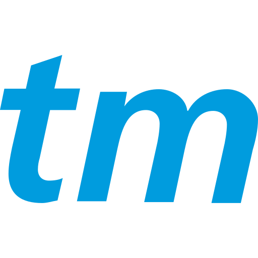

# Events Near Me Today

## User Story
```
As a very cool person looking for an an event
I want to find nearby shows/games and weather
So I can be fully prepared and comfortable for the festivities.
```

## Description
This dynamic event search tool locates events in your vicinity and provides real-time weather updates. Our integrated APIs deliver this information to your screen as soon as you search based on your desired city and state. With an engaging design driven by seamless and robust CSS & JavaScript, we offer the convenience of knowing the weather conditions you should prepare for before heading to your next Punk Rock concert or baseball game.

## Webpage Display


## API's Used
 
  

[WeatherAPI](https://www.weatherapi.com) || [Ticketmaster API](https://developer.ticketmaster.com/products-and-docs/apis/discovery-api/v2/)


## Credits
[Background Image of Our Webpage](https://wallpapercave.com/wp/wp2349475.jpg)


[UIKit](https://getuikit.com/docs/introduction) 

[Medium: Convert 24 hours format to 12 hours in Javascript](https://medium.com/front-end-weekly/how-to-convert-24-hours-format-to-12-hours-in-javascript-ca19dfd7419d#:~:text=Now%20in%2Dorder%20to%20convert,12%20on%20the%20current%20time.&text=time%20%3D%2024%2C%20then%2024%25,change%20the%20time%20as%2012.)

## Links
[Github Page](https://samelimill.github.io/event-finder-port/) || 
[Github Repo](https://github.com/samelimill/event-finder-port)


